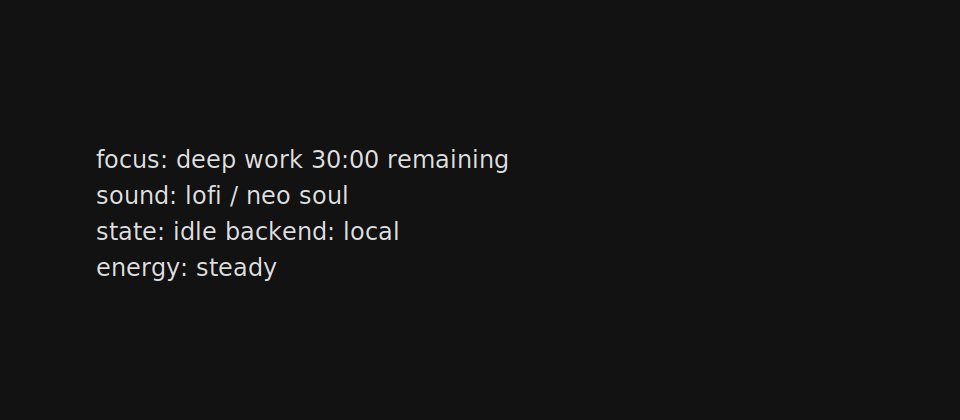

# Lofi Focus TUI

Session-first terminal UI for local AI-generated focus music.



The TUI instructs a local backend. The backend owns planning, ACE-Step integration,
device selection, continuity checks, playback state, and cache.

Initial development uses a deterministic mock generator before enabling ACE-Step.

## Development

```bash
python -m venv .venv
. .venv/bin/activate
python -m pip install -e ".[dev]"
pytest -v
```

## Run

Start the backend:

```bash
lofi-backend
```

Start the terminal UI in a second terminal:

```bash
lofi
```

With the backend running, press `s` in the TUI to start a mock deep-work session.
The TUI will update from `idle` to `playing` after the backend accepts the session.

## ACE-Step Smoke Test

ACE-Step is optional during normal development. Install it only on a machine prepared for model inference:

```bash
python -m pip install -e ".[ace-step]"
python -c "import importlib.util; print(importlib.util.find_spec('acestep') is not None)"
```

Expected output:

```text
True
```

Use the fake-pipeline tests for normal development. Run real ACE-Step generation only on a prepared GPU machine.
