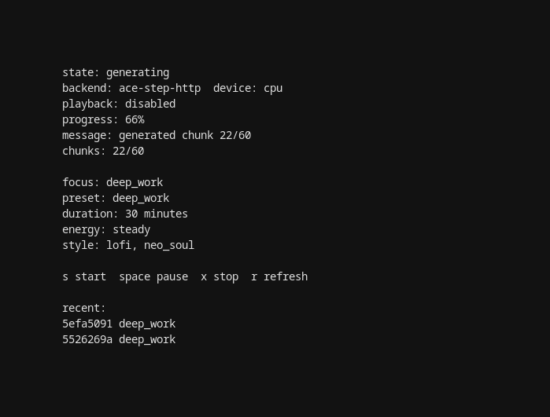

# Lofi Focus TUI

Session-first terminal UI for local AI-generated focus music.



The TUI instructs a local backend. The backend owns planning, ACE-Step integration,
device selection, continuity checks, playback state, and cache.

The normal default is ACE-Step over HTTP; mock mode is an explicit development fallback.

## Install and Run with ACE-Step

This is the normal setup for Linux users who want real AI-generated focus music. You will
use three terminal windows: one for ACE-Step, one for the Lofi backend, and one for the
TUI.

You need Python 3.11 or 3.12, Git, and [`uv`](https://docs.astral.sh/uv/). ACE-Step
downloads its models the first time it starts, so the first launch may take a while.

### 1. Install ACE-Step (once)

```bash
cd ~/Documents
git clone https://github.com/ace-step/ACE-Step-1.5.git
cd ACE-Step-1.5
uv sync
```

If you already installed ACE-Step, skip the `git clone` and `uv sync` commands.

### 2. Install Lofi Focus TUI (once)

```bash
cd ~/Documents
git clone https://github.com/Csavoldi/lofi-focus-tui.git
cd lofi-focus-tui
python3 -m venv .venv
source .venv/bin/activate
python -m pip install -e ".[playback]"
```

If you already have this repository, just `cd` into it and activate `.venv`.

### 3. Start the three pieces

Keep each command running in its own terminal window.

Terminal 1 — start the ACE-Step REST server:

```bash
cd ~/Documents/ACE-Step-1.5
uv run acestep-api
```

The REST server should be available at `http://127.0.0.1:8001`. Check it from another
terminal if needed:

```bash
curl http://127.0.0.1:8001/health
```

Terminal 2 — start the Lofi backend:

```bash
cd ~/Documents/lofi-focus-tui
source .venv/bin/activate
LOFI_BACKEND=ace-step-http lofi-backend
```

Terminal 3 — start the TUI:

```bash
cd ~/Documents/lofi-focus-tui
source .venv/bin/activate
lofi
```

The TUI is ready when it shows `backend: ace-step-http` and `message: ready`. Press `s`
to start a session. The first generation can take a few minutes.

### Use ACE-Step on another machine on your LAN

The TUI talks to the Lofi backend on port `8765`; the backend talks to ACE-Step on port
`8001`. If ACE-Step is hosted on another LAN machine, keep the Lofi backend and TUI local
and point the backend at the ACE-Step machine's LAN IP.

On the ACE-Step machine, bind the REST API to the LAN interface:

```bash
cd ~/Documents/ACE-Step-1.5
ACESTEP_API_HOST=0.0.0.0 ACESTEP_API_PORT=8001 uv run acestep-api
```

Allow inbound TCP port `8001` through that machine's firewall, preferably only from the
machine running `lofi-backend`. Do not expose the API directly to the public internet.

On the Lofi machine, create `config.toml` in the repository directory (or at
`~/.config/lofi-focus-tui/config.toml`):

```toml
[generation]
backend = "ace-step-http"

[ace_step_http]
base_url = "http://ACE_STEP_LAN_IP:8001"
api_key = ""
timeout_seconds = 1800.0
```

Replace `ACE_STEP_LAN_IP` with the AceStep machine's address, such as `192.168.2.109`.
If the AceStep server uses an API key, set the same key in `api_key`. `LOFI_BACKEND=ace-step-http`
can override the backend setting, but the URL is read from `config.toml`.

Test connectivity from the Lofi machine:

```bash
curl http://ACE_STEP_LAN_IP:8001/health
curl http://ACE_STEP_LAN_IP:8001/v1/models
```

Leave `[server] host = "127.0.0.1"` when the TUI and Lofi backend run on the same machine.
If the TUI itself runs on a different machine, configure its `[server] host` as the Lofi
backend machine's LAN IP and bind that backend to a LAN-reachable host as well.

### TUI controls

```text
s       start a session
space   pause or resume
x       stop
r       refresh status
1       change focus
p       change music preset
2       change duration
3       change energy
4       change style
[       lower volume
]       raise volume
,       rewind 10 seconds
.       forward 10 seconds
0       restart current audio
e       export audio and metadata
h       open option guide
Escape  close option guide
q       quit
```

focus and music preset are separate request fields.
See [`docs/usage.md`](docs/usage.md) for option meanings and guide behavior.

For a first test, press `2` until the duration says `5 minutes`, then press `s`. Generated
audio is saved under `~/.cache/lofi-focus-tui/outputs`. Press `e` after generation, enter an
export directory, and press Enter to copy the WAV and metadata there. The default is
`~/Music/lofi-focus-tui`.

### If something goes wrong

- **`backend: offline`**: make sure Terminal 2 is still running.
- **ACE-Step health check fails**: make sure Terminal 1 is running the REST server on
  port `8001`. The Gradio web UI on port `7860` is a different server and is not enough.
- **`address already in use`**: press `Ctrl-C` in the terminal running the old process,
  then start it again. The Lofi backend uses port `8765`; ACE-Step uses port `8001`.
- **No sound**: the WAV is still saved. Confirm that your computer has an audio output
  device and that you installed the `[playback]` extra above.

For advanced configuration and diagnostics, see [`docs/usage.md`](docs/usage.md),
[`docs/configuration.md`](docs/configuration.md), and [`docs/ace-step.md`](docs/ace-step.md).

## Development

```bash
python -m venv .venv
. .venv/bin/activate
python -m pip install -e ".[dev]"
pytest -v
```

## Quality Checks

```bash
ruff check src tests
pytest -v
```

## Developer mock mode

Mock mode does not require ACE-Step and is useful for development or troubleshooting.

Start the backend:

```bash
LOFI_BACKEND=mock lofi-backend
```

Start the terminal UI in a second terminal:

```bash
lofi
```

With the backend running, press `s` in the TUI to start a mock deep-work session.
The TUI will update from `idle` to `playing` after the backend accepts the session.

Run diagnostics:

```bash
lofi-doctor
```

Saved sessions are written under `~/.cache/lofi-focus-tui/outputs`, with history at
`~/.cache/lofi-focus-tui/history.jsonl`.

More detail:

- [Usage](docs/usage.md)
- [Configuration](docs/configuration.md)
- [ACE-Step modes](docs/ace-step.md)
- [User acceptance testing](docs/user-acceptance-testing.md)

## ACE-Step-1.5 HTTP Smoke Test

ACE-Step is optional during normal development. For release UAT, run the ACE-Step-1.5
REST API locally and point this app at it over HTTP.

```bash
git clone https://github.com/ace-step/ACE-Step-1.5.git
cd ACE-Step-1.5
uv sync
uv run acestep-api
```

The API should listen on `http://127.0.0.1:8001`.

In this repository, run the live UAT gate from a second terminal:

```bash
LOFI_UAT_ACE_STEP_BASE_URL=http://127.0.0.1:8001 pytest tests/test_live_ace_step_http.py -v
```

PowerShell:

```powershell
$env:LOFI_UAT_ACE_STEP_BASE_URL = "http://127.0.0.1:8001"
pytest tests/test_live_ace_step_http.py -v
```

Use the fake-pipeline tests for normal development. Run real ACE-Step generation only on a
prepared model-inference machine. Real ACE-Step-1.5 HTTP generation must pass before release.
